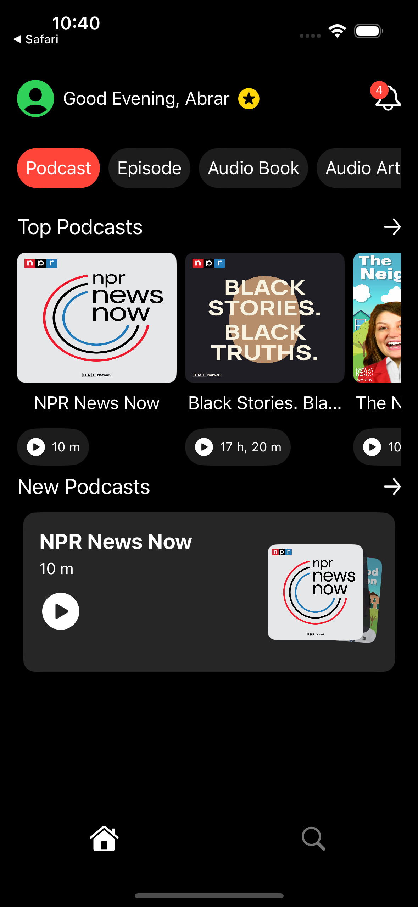
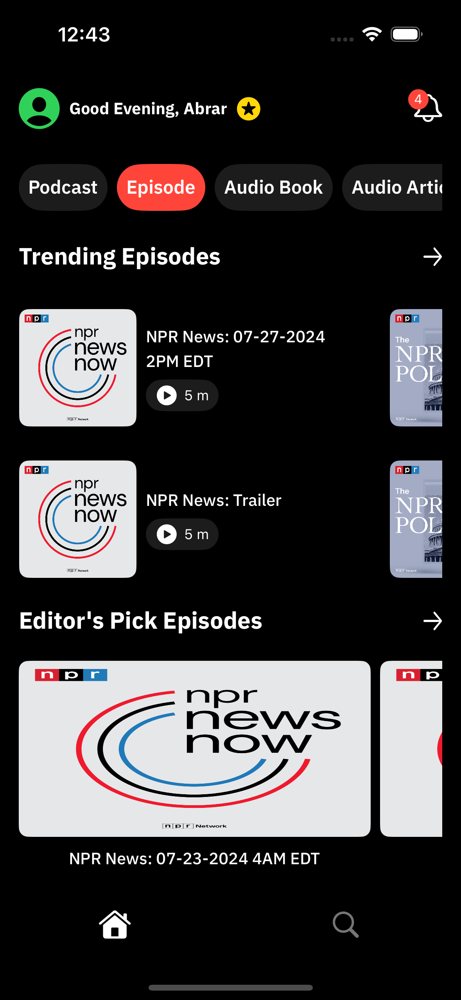
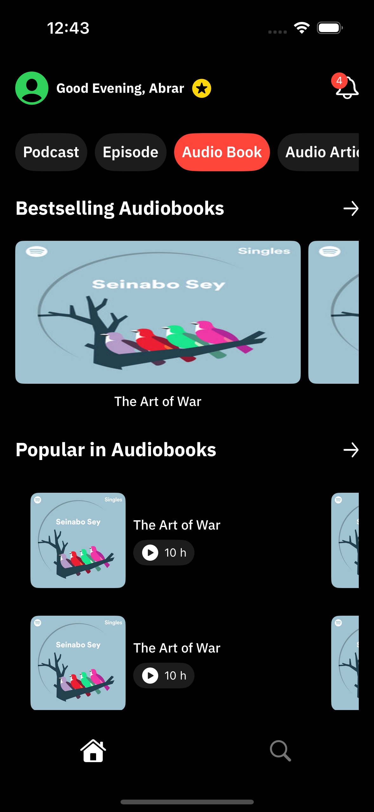
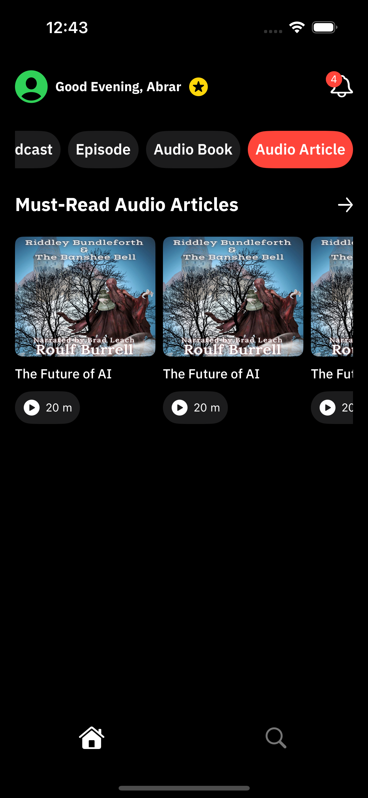
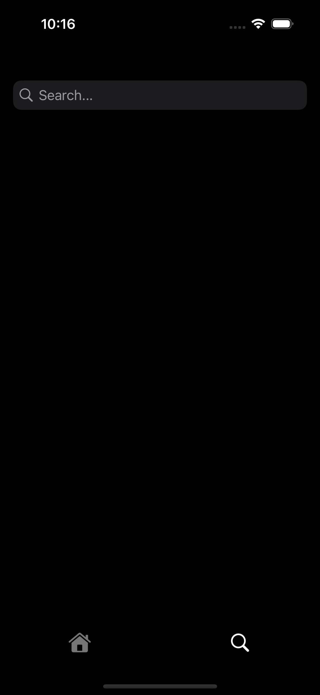
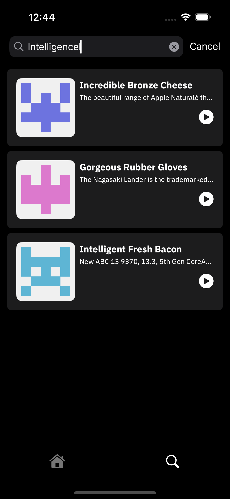
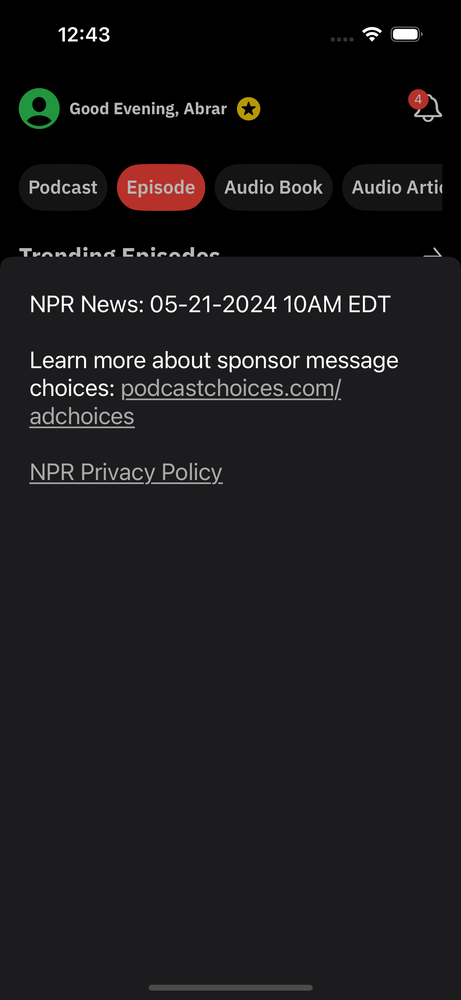

# Features:  
  - Main Screen has two tabs: Home and Search.
  * <ins>Home View</ins>:
      - Fetch **home sections** and their details.
      - Support multiple **display modes**: square, bigSquare, twoLinesGrid, and queue.
      - Tap on a card to view its **description** (UIKit) and **navigate** to the website for the full content (if there is a link).

  * <ins>Search View</ins>:
    - Implement **search** functionality with result display.
    - Start searching after a **200ms debounce delay**

  - For both:
    - Handle multiple **loading state** (loading, empty, error, and done) to show content according to the state (progress view, empty view, error view, and content view).   
    - Use **Swift Concurrency (Async/Await)** for api calls.
    - **Image loader** component to load image.
    - Apply **app fonts**.
    - Include **unit tests** for core logic.
    - Add **UI tests** for key interface components.
    - Use `SwiftUI` mainly and `UIKit` for the description bottom sheet.

# Requirements:
  - Xcode Version: 16.3.
  - iOS Deployment Target: +15.6.
  - Swift Version: 5.

# Architecture:
  - Clean Architecture and MVVM.

```bash
PodcastApp
├── Data
│   ├── DTO
│   │   └── Responses
│   ├── Mappers
│   ├── Network
│   └── Repository
│
├── Domain
│   ├── Entities
│   ├── Enums
│   ├── Extension
│   ├── Repository
│   └── UseCases
│
├── Network
│
├── Presentation
│   ├── View
│   └── ViewModel
│
└── Resources
    ├── AppFonts
    └── Assets

PodcastAppTests
PodcastAppUITests
```


# Screenshots:
  - Home View:
    
    
    
    
    
    
    
    


  - Search View:
    
    
    
    
    
  - Description Bottom Sheet:

    

    


