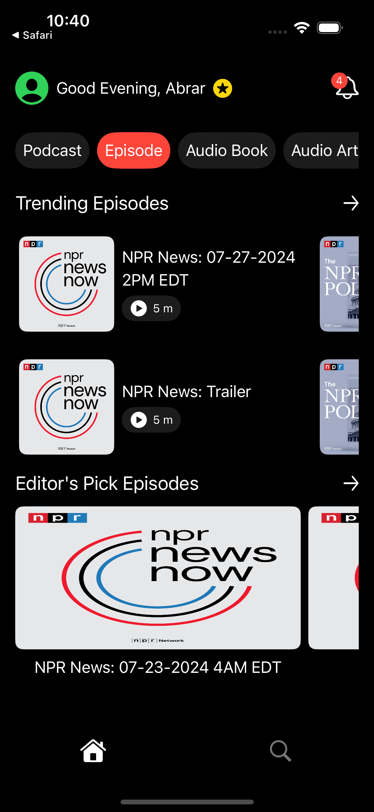
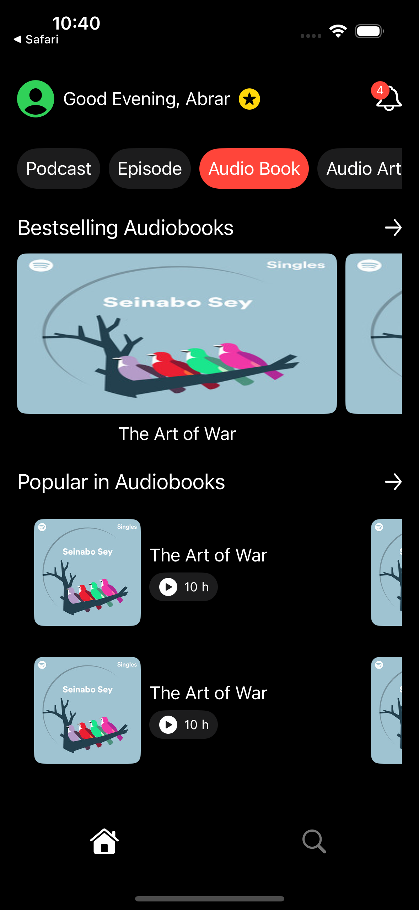

# Features:  
  - Fetch home sections and their details.
  - Support multiple display modes: square, bigSquare, twoLinesGrid, and queue.
  - Tap a card to view its description and navigate to the website for the full content (if there is a link).
  - Implement search functionality with result display.
  - Start searching after a 200ms debounce delay.
  - Include unit tests for core logic.
  - Add UI tests for key interface components.

# Requirements:
  - Xcode Version: 16.3.
  - iOS Deployment Target: +15.6.
  - Swift Version: 5.

# Architecture:
  - Clean Architecture and MVVM.

# Screenshots:
  - Home View:
    
    
    
    
    
    
    
    

  - Search View:
    
    

    
  - Description Bottom Sheet:
    
    
